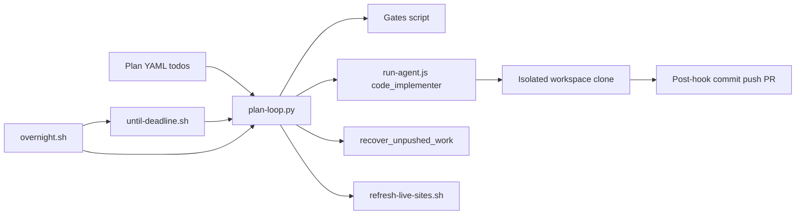

> **Markdown plans** (single goal file, phased deliverables, `## Completion gate`):
> use **`run-goal-directed-loop`** + `goal-directed-loop.sh`. Exit 0 only when the gate passes.
>
> **This skill** covers **YAML todo plans** driven by `*-plan-loop.py` (httpd, etc.).

> **Markdown sprint plans (phase table + Completion gate):** use skill **`run-goal-directed-loop`** and `scripts/goal-directed-loop.sh` instead of YAML `plan-loop.py` when the goal is a single `.md` file.
# Goal-directed plan loop (li-cursor-agents)

Drive a **YAML todo plan** with a **reusable registry agent** (`code_implementer` by default), not a one-off agent id. Each iteration passes the todo slice as `--goal-file` / `LI_AGENT_GOAL`.

**Reference implementation (lic / li-httpd):** `lic/scripts/httpd-plan-loop.py` + `httpd-plan-overnight.sh` + `httpd-plan-until-deadline.sh`.  
**Repo workflow:** `LI_REPO_WORKFLOW_*` + post-hook push (see `prompts/repo-workflow-tools.md`).

## Prerequisites

| Requirement | Notes |
|-------------|--------|
| `CURSOR_API_KEY` | Cursor Cloud / SDK |
| `GH_TOKEN` | Push + PR + optional Pages deploy |
| `li-cursor-agents` built | `npm ci && npm run build` |
| Node ≥ 24 | On `PATH` (e.g. `~/.local/node/bin`) |
| Sibling `benchmarks` | Optional preflight + `refresh-live-sites.sh` |

Load secrets: `LI_CURSOR_ENV_FILE` (default `~/Documents/Cursor/.env`).

## Quick start (httpd plan)

```bash
cd lic
export LI_CURSOR_AGENTS_ROOT=../li-cursor-agents
export BENCHMARKS_ROOT=../benchmarks
export HTTPD_PLAN_PR_BRANCH=cursor/httpd-plan-continue

# Dry-run: next todo + goal text
./scripts/httpd-plan-loop.py --dry-run

# One iteration
./scripts/httpd-plan-loop.py --once

# Overnight: first batch then until 08:00 local
./scripts/httpd-plan-overnight.sh
```

Background:

```bash
nohup ./scripts/httpd-plan-overnight.sh >> data/httpd-plan-loop/overnight-runner.out 2>&1 &
# Or extend an in-flight --max batch until morning:
nohup ./scripts/httpd-plan-until-deadline.sh >> data/httpd-plan-loop/until-deadline-runner.out 2>&1 &
```

## Architecture



1. **Pick todo** — `pending` / `in_progress`, prefer plan prefix (e.g. `m1*`), skip `completed_ids` in `state.json`.
2. **Gates** — repo verification script; may allow skip flags when compiler absent.
3. **Agent** — `node dist/cli/run-agent.js --agent … --goal-file … --workflow-repo lic`.
4. **Push** — agent instructed to push; post-hook pushes unpublished commits; loop **recovery** scans `lic` checkout + latest workspace clones.
5. **Pages** — after success, optional `benchmarks/scripts/refresh-live-sites.sh` (skill `run-local-pages-benchmarks`).
6. **Until deadline** — if first `--max` batch ends early, start more batches until local `HTTPD_PLAN_UNTIL_LOCAL` (default `08:00`).

## Agent env (set by loop)

| Variable | Purpose |
|----------|---------|
| `LI_HTTPD_PLAN_LOOP=1` | Minimal prompt; goal-only |
| `LI_REPO_WORKFLOW_REPO` | Target repo (`lic`) |
| `LI_REPO_WORKFLOW_BRANCH` | Feature branch (track remote) |
| `LI_REPO_WORKFLOW_TRACK_REMOTE=1` | `checkout origin/<branch>` |
| `LI_REPO_WORKFLOW_OPEN_PR=1` | Open/update PR after push |
| `LI_AGENT_GOAL` / `LI_AGENT_EXTRA_INSTRUCTION` | Todo slice markdown |

## Scheduling env

| Variable | Default | Purpose |
|----------|---------|---------|
| `HTTPD_PLAN_OVERNIGHT_MAX` | `30` | First batch size |
| `HTTPD_PLAN_UNTIL_LOCAL` | `08:00` | Stop deadline (local) |
| `HTTPD_PLAN_MIN_PER_ITER` | `12` | Minutes per iter for batch sizing |
| `HTTPD_PLAN_BATCH_CAP` | `30` | Max `--max` per until-deadline batch |
| `HTTPD_PLAN_NO_UNTIL_DEADLINE` | `0` | Set `1` = single batch only |
| `HTTPD_PLAN_WAIT_FOR_LOOP` | `1` | Wait for in-flight loop (until-deadline) |
| `LI_HTTPD_PLAN_AGENT_TIMEOUT_SEC` | `2700` | Per-agent cap (45m) |

## Logs and state

| Path | Content |
|------|---------|
| `data/httpd-plan-loop/state.json` | `completed_ids`, `history`, `iterations` |
| `data/httpd-plan-loop/iter-*.log` | Per-agent SDK stream |
| `data/httpd-plan-loop/overnight-*.log` | Full overnight tee |
| `data/httpd-plan-loop/until-deadline-*.log` | Deadline extension |

## Morning report checklist

1. `state.json` — `history` length, last `agent_exit`, `gates_ok`
2. Newest `iter-*.log` — PR URLs, premature completion
3. GitHub branch `HTTPD_PLAN_PR_BRANCH` — commits ahead of `main`
4. Live sites updated? (benchmarks + development overview)

## New plan (non-httpd)

Copy the pattern:

1. Superpowers plan markdown with YAML `todos:` frontmatter.
2. `scripts/<name>-plan-loop.py` — pick_next, gates, `run_cursor_agent`, `build_instruction`, state dir.
3. Optional `scripts/<name>-plan-overnight.sh` + `scripts/<name>-plan-until-deadline.sh` (reuse deadline script with env prefix).
4. Register gates in CI; document in repo `AGENTS.md`.

Details: [reference.md](reference.md).


## When tools block you

Same as markdown sprint loops: skill **`agent-self-unblock`**. Plan-loop agents use Shell/Python/WSL when Read or StrReplace fail closed; keep iterating until gates pass.

## Related skills

- `run-local-pages-benchmarks` — ingest + deploy after bench/org changes
- `audit-plan-completion` — verify plan YAML vs repo reality
- `plan-feature-from-issue` — slice work before adding todos
