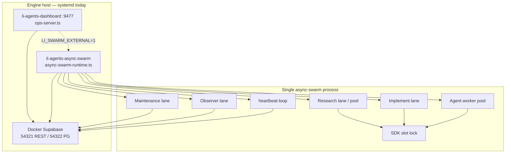

# Swarm on Kubernetes + Li-native message queue (plan)

**Date:** 2026-05-30  
**Status:** Planning only — no MQ implementation in this doc  
**Scope:** Split `li-cursor-agents` async swarm across four K8s workloads on the user cluster (Beelink-class host), keep Supabase/control-plane DB as coordination store, add a new **Li MQ** persisted in **lidb** and exposed through **lis** with TLS at the edge.

---

## 1. Executive summary

Today the production swarm is a **single Node process** (`startAsyncSwarm` in `src/async-swarm/async-swarm-runtime.ts`) started by `li-agents-async-swarm.service`, with state in **Supabase** (`LI_CONTROL_PLANE_STORE=supabase`) and ops API on **`:9477`** (`src/ops-server.ts`). There is **no checked-in Kubernetes or “Beelink” deployment** yet; the closest operational record is **systemd + Docker Supabase** on a LAN engine (`192.168.10.32` in `docs/ecosystem/dashboard-lan-access.md`, `lic/docs/ecosystem/swarm-ops-status.md`).

This plan proposes:

1. **Control plane DB** on-cluster: Supabase (short term) or `lis db` / **lidb** (PH-DB target) as a StatefulSet or host-level service the pods share.
2. **Four Deployments** mapped to existing runtime slices (research pool, general swarm, CI agents, supervisor/ops).
3. **`limq`** — durable queue tables in lidb, HTTP/gRPC-style API behind lis (TLS via li-httpd or interim proxy), used for cross-pod commands and events while DB remains source of truth for runs/handoffs/state.

---

## 2. Current async swarm architecture

### 2.1 Entry points and processes

| Component | Path / unit | Role |
|-----------|-------------|------|
| Async swarm CLI | `src/cli/async-swarm.ts` → `dist/cli/async-swarm.js` | Foreground or detached swarm process |
| Runtime orchestrator | `src/async-swarm/async-swarm-runtime.ts` | `startAsyncSwarm` / `stopAsyncSwarm` |
| In-process flags | `src/async-swarm/async-swarm-state.ts` | `async_swarm_running`, worker pool snapshot |
| Ops / dashboard worker | `src/ops-server.ts` (port **9477**) | REST control, lane toggles, handoff phases |
| Legacy supervisor | `src/supervisor/loop.ts`, `src/control-plane/runtime.ts` | Tick queue + heap dispatch (optional; disabled when async swarm runs) |
| Systemd | `scripts/install-agents-swarm-systemd.sh` | `li-agents-dashboard.service`, `li-agents-async-swarm.service`, watchdog/sweep timers |
| Reconcile on boot | `src/worker/swarm-reconcile.ts` | Resumes swarm from `worker_status.async_swarm_running` |

`startAsyncSwarm` (monolith) currently starts **all** of:

```text
startResearchLaneLoop      → src/lanes/lane-runtime.ts
startImplementLaneLoop
startMaintenanceLaneLoop
startObserverLaneLoop
startAgentWorkerPool       → src/async-swarm/agent-worker-pool.ts
```

Plus `startWorkerHeartbeatLoop` (`src/worker/heartbeat-loop.ts`) and disables the supervisor loop (`stopSupervisorLoop`).

### 2.2 Lanes and agent partitioning (today)

| Slice | Code | Agents / work |
|-------|------|----------------|
| **Research** | `startResearchLaneLoop` → either serial `researchLoop` or `startResearchAgentWorkerPool` (`src/async-swarm/research-agent-worker-pool.ts`) when `researchParallelEnabled()` | Agents from `researchLaneAgentIds()` (`src/lanes/lane-agent-ids.ts`) — one agent per enabled row in `config/research-goals.yaml` (~27 goals) |
| **Implement** | `implementLoop` + `implementLaneTick` (`src/lanes/implement-lane.ts`) | `code_implementer`, `package_architect` (`IMPLEMENT_LANE_AGENTS`) |
| **Maintenance** | `maintenanceLaneTick` | Briefing enrich, scorecards — **no LLM SDK** |
| **Observer** | `observerLaneTick` (`src/observer/`) | Retries, `bench_improver`, `swarm_observer`, remediations |
| **Worker pool** | `agentWorkerCycle` per `asyncWorkerAgentIds()` | All registry agents **not** in research or implement lanes (~22 agents); includes `ci_maintainer`, `bug_fixer`, meta graders, etc. |

Registry: `src/agents/registry.ts` (**34** `AgentDefinition` entries). SDK concurrency: `LI_SDK_MAX_CONCURRENT` (default **4** in systemd install, **5** cited in swarm-architecture for research-heavy profiles) via `src/config/swarm-concurrency.ts` and `src/backends/sdk-session-lock.ts`.

### 2.3 Control plane and persistence

| Concern | Implementation |
|---------|----------------|
| Store selector | `src/db/client.ts` — `LI_CONTROL_PLANE_STORE=supabase \| disk \| lidb` |
| Writes | `src/db/persist.ts`, `src/db/live-stream-persist.ts`, `src/handoffs/handoff-store.ts` |
| Schema catalog | `src/db/schema-catalog.ts` → `CONTROL_PLANE_TABLES` |
| Migrations | `supabase/migrations/` (e.g. `20260517120000_control_plane.sql`, `20260517151000_swarm_handoffs_sessions.sql`) |
| Local DB bootstrap | `scripts/ensure-supabase.sh`, `npm run db:ensure` |
| Failover | `LI_SUPABASE_FAILOVER`, standby worktree ports **54421/54422** (`docs/ecosystem/swarm-architecture.md`) |
| Future lidb path | `docs/plans/lidb-migration-control-plane.md`, `src/mcp/lidb-liq-mcp.ts`, `src/db/liq-query.ts` |

**Tables agents rely on today:** `agent_runs`, `agent_run_events`, `agent_handoffs`, `control_plane_state`, `control_plane_reports`, `briefing_snapshots`, `heap_plan_snapshots`, `queued_agent_tasks`, `worker_status` (heartbeat), `research_sessions`, etc.

### 2.4 Dashboard and external integration

- Static + API: `web/`, Next shell `dashboard-ui/` → worker **9477** for mutating routes.
- Docs: `docs/ecosystem/swarm-architecture.md`, `docs/ecosystem/agent-automations.md`, `docs/ecosystem/swarm-runtime-profiles.md`.
- GHA: `swarm-maintenance-cron.yml`, `swarm-audit-cron.yml` (maintenance lane only; not a replacement for async swarm).

### 2.5 Architecture diagram (as-is)



---

## 3. Beelink / Kubernetes deployment state (repo survey)

### 3.1 “Beelink”

**No file in the monorepo mentions “Beelink”.** Treat the user’s Beelink as the **private engine host** already described operationally:

| Evidence | Path | Implication |
|----------|------|-------------|
| LAN dashboard | `li-cursor-agents/docs/ecosystem/dashboard-lan-access.md` | `http://192.168.10.32:9477/` — bind `0.0.0.0`, async swarm in **separate** systemd unit |
| Swarm ops baseline | `lic/docs/ecosystem/swarm-ops-status.md` | User `s4il0r`, `li-agents-dashboard` + `li-agents-async-swarm` **active**, store **supabase** |
| Install path | `scripts/install-agents-swarm-systemd.sh` | Production pattern today, not K8s |

**Assumption for K8s:** Beelink (or k3s/microk8s on same hardware) replaces **user systemd units** with **Deployments**, but keeps the same secrets (`CURSOR_API_KEY`, `GH_TOKEN`, Supabase URL keys from `.env.supabase`).

### 3.2 Kubernetes in repo

| Area | Finding |
|------|---------|
| li-cursor-agents | **No** Deployment/Helm manifests; only env hints (`K8s secret` in `lis/docs/production-registry.md`) |
| PH-DB plans | `lic/docs/superpowers/plans/ph-db-ci-hosting-plan.md` — **“Not in MVP: Kubernetes operators”**; target is `docker-compose.ph-db.yml` + `lis db` |
| lis | `lis/docs/production-registry.md` — TLS at **li-httpd** proxy to `127.0.0.1:54321`; pattern reusable for MQ API |

**Conclusion:** K8s swarm is **greenfield in git**; operational state is likely **already running on the Beelink via systemd** and must be validated on the host (`kubectl get pods`, existing Supabase release) before apply.

### 3.3 Recommended control-plane DB on cluster

**Phase A (migrate swarm first):** Run existing **Supabase CLI stack** (`npm run db:ensure`) as either:

- A **cluster-external** service on the Beelink (Docker on host, pods use `host.docker.internal` or node IP), or
- A **Supabase Helm/OCI chart** in namespace `li-control-plane` if already deployed.

**Phase B (align with PH-DB):** Single-replica **`lis db`** Deployment with PVC `li-data`, ports **54321** (REST-shaped) / **54322** (wire), per `lis/docs/architecture.md` and `docs/plans/lidb-migration-control-plane.md`.

Pods use one Secret:

```yaml
# keys (names illustrative)
SUPABASE_URL / SUPABASE_SERVICE_ROLE_KEY   # phase A
LI_CONTROL_PLANE_STORE=supabase|lidb
LI_DATA_DIR=/var/lib/li-data              # phase B
LI_LIDB_URL=...                            # optional explicit
```

---

## 4. Proposed four-pod Kubernetes layout

### 4.1 Pod class mapping

| Pod class | Deployment name (suggested) | Starts (new env `LI_SWARM_ROLE`) | SDK budget (suggested) |
|-----------|----------------------------|-----------------------------------|-------------------------|
| **1 — Research** | `li-swarm-research` | Research lane only (`startResearchLaneLoop`); `LI_SWARM_PAUSE_WORKERS=1`, `LI_IMPLEMENT_LANE_ENABLED=0`, `LI_OBSERVER_DISABLE=1`, `LI_MAINTENANCE_LANE_ENABLED=0` | `LI_SDK_MAX_CONCURRENT=2` (research-heavy) |
| **2 — General swarm** | `li-swarm-workers` | Implement + maintenance + observer + worker pool; **exclude** CI agents via `LI_SWARM_AGENT_ALLOWLIST` / denylist | `LI_SDK_MAX_CONCURRENT=4` |
| **3 — CI** | `li-swarm-ci` | Dedicated loops for `ci_maintainer`, `bug_fixer` only (new thin runner or allowlist=2) | `LI_SDK_MAX_CONCURRENT=2` |
| **4 — Supervisor** | `li-swarm-supervisor` | Dashboard worker (`ops-server`) + optional **legacy** `runSupervisorLoop` + global heartbeat owner; **does not** run `startAsyncSwarm` | `0` LLM slots (control only) |

**Cross-cutting:** Only **one** pod should write `worker_status` leader fields per tick, or partition columns by `pod_role` (schema change — see risks).

### 4.2 Manifest sketch (namespace `li-swarm`)

```yaml
apiVersion: v1
kind: Namespace
metadata:
  name: li-swarm
---
apiVersion: v1
kind: Secret
metadata:
  name: li-swarm-secrets
  namespace: li-swarm
type: Opaque
stringData:
  CURSOR_API_KEY: "<from vault>"
  GH_TOKEN: "<from vault>"
  SUPABASE_URL: "http://li-supabase-rest.li-control-plane:54321"
  SUPABASE_SERVICE_ROLE_KEY: "<service role>"
  LIMQ_HMAC_SECRET: "<queue signing>"
---
apiVersion: apps/v1
kind: Deployment
metadata:
  name: li-swarm-research
  namespace: li-swarm
spec:
  replicas: 1
  selector:
    matchLabels: { app: li-swarm-research }
  template:
    metadata:
      labels: { app: li-swarm-research }
    spec:
      containers:
        - name: swarm
          image: ghcr.io/li-langverse/li-cursor-agents:latest # build TBD
          command: ["node", "dist/cli/async-swarm.js", "start"]
          env:
            - name: LI_SWARM_ROLE
              value: research
            - name: LI_CONTROL_PLANE_STORE
              value: supabase
            - name: LI_SWARM_PAUSE_WORKERS
              value: "1"
            - name: LI_IMPLEMENT_LANE_ENABLED
              value: "0"
            - name: LI_OBSERVER_DISABLE
              value: "1"
            - name: LI_MAINTENANCE_LANE_ENABLED
              value: "0"
            - name: LI_SDK_MAX_CONCURRENT
              value: "2"
            - name: LIMQ_URL
              value: "https://lis-mq.li-swarm.svc.cluster.local"
          envFrom:
            - secretRef: { name: li-swarm-secrets }
          resources:
            requests: { cpu: "500m", memory: 1Gi }
            limits: { cpu: "4", memory: 8Gi }
---
# li-swarm-workers — same Secret; LI_SWARM_ROLE=workers; LI_SWARM_PAUSE_WORKERS=0;
#   LI_IMPLEMENT_LANE_ENABLED=1; LI_OBSERVER_DISABLE=0; LI_MAINTENANCE_LANE_ENABLED=1
#   LI_SWARM_AGENT_DENYLIST=ci_maintainer,bug_fixer
---
# li-swarm-ci — LI_SWARM_ROLE=ci; LI_SWARM_AGENT_ALLOWLIST=ci_maintainer,bug_fixer
---
# li-swarm-supervisor — command: node dist/cli/serve-dashboard.js or worker entry;
#   LI_AUTO_START_ASYNC_SWARM=0; LI_SWARM_EXTERNAL=1; Service port 9477
```

**Shared volume (optional):** `emptyDir` or PVC for `data/control-plane/` IPC mirror when store=supabase (read-only goals YAML baked in image).

**ConfigMap:** `config/research-goals.yaml`, `config/implement-goals.yaml`, `scripts/env.defaults.sh` overrides.

### 4.3 Code changes required (not in this PR)

Refactor `startAsyncSwarm` into `startSwarmForRole(role: SwarmRole)` in `async-swarm-runtime.ts` that branches on `LI_SWARM_ROLE` instead of always starting all five subsystems. Mirror stop/reconcile in `swarm-reconcile.ts` and `swarm-health-collect.ts`.

---

## 5. Li-native message queue (`limq`)

### 5.1 Design goals

| Goal | Approach |
|------|----------|
| **Fast** | Row-level `FOR UPDATE SKIP LOCKED` claim pattern in lidb; optional in-memory notify later (PH-DB+ ) |
| **Persistent in lidb** | Dedicated tables + migrations in `lidb/migrations/` (and parity row in `supabase/migrations/` until store flip) |
| **Traceable** | `trace_id`, `correlation_id`, `source_run_id` → `agent_runs.run_id` |
| **Easy API** | `POST /v1/mq/publish`, `POST /v1/mq/claim`, `POST /v1/mq/ack` on lis registry server |
| **TLS** | Terminate at lis edge (li-httpd per `lis/docs/production-registry.md` §4) |

MQ **complements** Supabase/lidb control plane: handoffs and runs stay in existing tables; MQ carries **commands and events** (lane tick request, slot release, pod heartbeat, implement dispatch).

### 5.2 Schema (lidb / public)

```sql
-- limq_topics: logical stream
create table limq_topics (
  topic text primary key,
  retention_hours int not null default 168,
  max_payload_bytes int not null default 65536
);

-- limq_messages: append-only with claim lease
create table limq_messages (
  id uuid primary key default gen_random_uuid(),
  topic text not null references limq_topics(topic),
  payload jsonb not null,
  headers jsonb not null default '{}',
  trace_id text not null,
  correlation_id text,
  source_run_id text references agent_runs(run_id) on delete set null,
  created_at timestamptz not null default now(),
  available_at timestamptz not null default now(),
  priority smallint not null default 0,
  delivery_count int not null default 0,
  max_deliveries int not null default 8,
  claimed_by text,
  claimed_until timestamptz,
  acked_at timestamptz,
  dead_at timestamptz
);

create index limq_claim_idx on limq_messages (topic, available_at, priority desc)
  where acked_at is null and dead_at is null;

-- limq_consumer_cursors: at-least-once fan-out / replay
create table limq_consumer_cursors (
  consumer_group text not null,
  topic text not null references limq_topics(topic),
  last_message_id uuid,
  updated_at timestamptz not null default now(),
  primary key (consumer_group, topic)
);

-- limq_audit: optional append for compliance
create table limq_audit (
  id bigserial primary key,
  message_id uuid not null,
  event text not null, -- published | claimed | acked | nacked | dead
  actor text not null,
  detail jsonb,
  at timestamptz not null default now()
);
```

**Persistence semantics:**

- **Publish:** single INSERT; visible after commit.
- **Claim:** one transaction — `SELECT … FOR UPDATE SKIP LOCKED LIMIT n` then set `claimed_by`, `claimed_until = now() + lease`.
- **Ack:** set `acked_at`; delete or archive per topic retention job.
- **Nack:** increment `delivery_count`, clear claim, set `available_at = now() + backoff`; if `delivery_count >= max_deliveries` → `dead_at` + optional `limq_dlq` view.
- **Ordering:** strict FIFO per `topic` + `correlation_id` optional partition key (add column if needed).

### 5.3 Producer / consumer API

**HTTP (lis)** — mount under existing registry server (`lis/routes/registry/server.py` or new `lis/routes/mq/`):

| Method | Path | Body | Response |
|--------|------|------|----------|
| POST | `/v1/mq/publish` | `{ topic, payload, trace_id, correlation_id?, source_run_id?, priority? }` | `{ id, created_at }` |
| POST | `/v1/mq/claim` | `{ topic, consumer_id, max=10, lease_ms=30000 }` | `{ messages: [...] }` |
| POST | `/v1/mq/ack` | `{ ids: [uuid] }` | `{ acked: n }` |
| POST | `/v1/mq/nack` | `{ ids, reason? }` | `{ requeued: n }` |
| GET | `/v1/mq/topics` | — | catalog |

**TypeScript client (future, `li-cursor-agents`):** `src/mq/limq-client.ts` — used by lanes to emit `implement.dispatch`, `research.goal.tick`, `observer.remediation`.

**Auth:** HMAC header `X-Li-Mq-Signature` or mTLS behind lis; same secret as K8s `LIMQ_HMAC_SECRET`.

### 5.4 Tracing

- Propagate `trace_id` (W3C `traceparent` optional) from `runAgent` → publish.
- Store `source_run_id` on every message tied to an agent run.
- Dashboard: join `limq_audit` + `agent_run_events` by `trace_id` (later UI).

### 5.5 lis TLS routing

Per `lis/docs/production-registry.md`:

- Registry REST today: `127.0.0.1:54321` → public `https://<host>/v1`.
- Add route group **`/v1/mq/*`** on same listener (or dedicated port `54323` if isolation needed).
- TLS: **li-httpd** `setup-tls` (target) or nginx/Caddy → upstream to lis MQ handlers.
- K8s: `Ingress` → `Service/lis` → pod; pods use **in-cluster** `http://lis.li-control-plane.svc:54321` without TLS; external operators use TLS ingress.

---

## 6. How DB + MQ divide responsibility

| Data | Channel |
|------|---------|
| Run history, events, prompts | `agent_runs`, `agent_run_events` (DB) |
| Handoffs | `agent_handoffs` (DB) |
| Supervisor snapshot | `control_plane_state` (DB) |
| Cross-pod “do work now” | **limq** topics e.g. `swarm.implement`, `swarm.research`, `swarm.ci`, `swarm.control` |
| Slot pressure / backpressure | MQ message `sdk.slot.release` + DB read of active runs |
| Watchdog restart | MQ `swarm.pod.restart` consumed by supervisor pod |

**Rule:** If it must survive pod crash and be queryable by dashboard → **DB**. If it is ephemeral coordination with at-least-once delivery → **MQ**.

---

## 7. Migration path (monolith → 4 pod + MQ)

### Phase 0 — Discover host state (day 0)

1. On Beelink: `kubectl get ns,deploy,statefulset -A`; document existing Supabase/Postgres.
2. `curl http://127.0.0.1:9477/api/runtime` — confirm `async_swarm_running`, `control_plane_store`.
3. Export secrets template from `~/Documents/Cursor/.env` + `li-cursor-agents/.env.supabase` (no keys in git).

### Phase 1 — DB on cluster (week 1)

1. Deploy or pin Supabase endpoint reachable from a test namespace.
2. Run migrations: `npm run db:ensure` from a Job or maintainer pod.
3. Point one replica of current monolith image at cluster DB; validate `agent_handoffs` and heartbeats.

### Phase 2 — `LI_SWARM_ROLE` split (week 2–3)

1. Implement role-gated `startAsyncSwarm` / `stopAsyncSwarm`.
2. Deploy **research** + **workers** only; keep CI and supervisor in monolith until stable.
3. `LI_SWARM_EXTERNAL=1` on supervisor Deployment; disable in-process swarm on dashboard.

### Phase 3 — limq MVP (week 4–5)

1. Land lidb migrations + lis routes (read-only consumer in agents).
2. Dual-write: publish MQ events on handoff create (DB still authoritative).
3. Cut observer remediations to MQ-triggered ticks on workers pod.

### Phase 4 — CI + supervisor pods (week 6)

1. Isolate `ci_maintainer` / `bug_fixer`.
2. Move watchdog (`src/swarm/swarm-watchdog-core.ts`) to supervisor pod; use MQ for `restart_async_swarm` signals instead of local systemctl where possible.

### Phase 5 — lidb store flip (PH-DB gated)

1. When `LI_CONTROL_PLANE_STORE=lidb` passes PH-DB DoD (`lic/docs/superpowers/plans/ph-db-ci-hosting-plan.md` §9), colocate limq with same lidb volume.
2. Retire Docker Supabase on Beelink if desired.

---

## 8. Risks and open questions

### Risks

| Risk | Mitigation |
|------|------------|
| **SDK slot oversubscribe** across pods (each sets `LI_SDK_MAX_CONCURRENT`) | Global slot coordinator via MQ + DB count of `status=running`; or lower per-pod caps |
| **Duplicate lane ticks** (two pods run implement) | Single consumer group per topic; DB idempotency keys on handoff dispatch |
| **`worker_status` races** | Leader election (supervisor pod) or split columns by `LI_SWARM_ROLE` |
| **Handoffs without MQ** still work but pods may poll DB heavily | Keep handoff reads on DB; MQ only for push |
| **No K8s in PH-DB MVP** | Compose on host for lis/lidb until operator chart exists |
| **File-based locks** (`sdk-session-lock`) on shared PVC | Prefer one lock dir per pod (ephemeral) + distributed lease table later |

### Open questions

1. **Is Supabase already running on Beelink K8s, or only Docker on the host?** (Blocks Service URLs.)
2. **Should Pod 4 run the Next.js `dashboard-ui` or only `ops-server`?**
3. **Supervisor:** keep legacy tick loop at all, or only async-swarm + MQ (supervisor doc says production uses async)?
4. **Research pod:** parallel worker pool only (`researchParallelEnabled`) or serial lane — env today?
5. **CI pod:** include `workspace_sweeper` / local-ci sweep hooks tied to merge agents?
6. **limq:** strict ordering per `correlation_id` required for implement handoffs?
7. **Beelink naming:** add `docs/ops/beelink-k8s.md` runbook when host inventory is confirmed?

---

## 9. File reference index

| Area | Paths |
|------|-------|
| Async swarm | `src/async-swarm/async-swarm-runtime.ts`, `async-swarm-state.ts`, `agent-worker-pool.ts`, `research-agent-worker-pool.ts`, `continuous-agent-loop.ts` |
| Lanes | `src/lanes/lane-runtime.ts`, `research-lane.ts`, `implement-lane.ts`, `maintenance-lane.ts`, `lane-agent-ids.ts` |
| Control plane | `src/control-plane/runtime.ts`, `state.ts`, `supervisor-activity.ts` |
| Supervisor | `src/supervisor/loop.ts` |
| Ops API | `src/ops-server.ts`, `src/cli/serve-dashboard.ts` |
| DB | `src/db/client.ts`, `persist.ts`, `schema-catalog.ts`, `supabase/migrations/` |
| Goals | `config/research-goals.yaml`, `config/implement-goals.yaml` |
| Systemd / ops docs | `scripts/install-agents-swarm-systemd.sh`, `docs/ecosystem/swarm-architecture.md`, `dashboard-lan-access.md`, `lic/docs/ecosystem/swarm-ops-status.md` |
| PH-DB / lis | `docs/plans/lidb-migration-control-plane.md`, `lis/docs/architecture.md`, `lis/docs/production-registry.md`, `lic/docs/superpowers/plans/ph-db-ci-hosting-plan.md` |

---

## 10. Out of scope (this plan)

- Implementing `limq` tables, lis routes, or `LI_SWARM_ROLE` branching.
- Building container images or applying manifests to the Beelink cluster.
- Replacing Supabase with lidb before PH-DB production gates.
