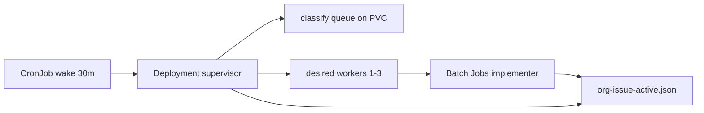

# Org-issue supervisor (Kubernetes)

Prototype for **Kubernetes-ready org-issue swarm**: a long-running supervisor on the engine cluster spawns isolated implementer Jobs while open org issues remain.

## Flow



1. **Wake CronJob** (`li-org-issue-supervisor-wake`, `*/30 * * * *`) runs `org-issue-supervisor.js wake` — scales Deployment `li-org-issue-supervisor` to 1 replica.
2. **Supervisor Deployment** loops while `total_open > 0`: refreshes `org-issue-queue.json`, reads/writes `org-issue-active.json` on PVC `li-agents-sprint-data`, spawns up to **3** implementer Jobs.
3. **Implementer Job** (one issue each): loads issue from GitHub, runs `code_implementer` (or `LI_ORG_ISSUE_IMPLEMENTER_AGENT`) via Cursor SDK, posts claim comment, appends `org-issue-implement-audit.jsonl`, marks active entry completed/failed.

## Scaling formula

`desiredWorkers = min(maxWorkers, max(1, ceil(openCount / 50)))` with `maxWorkers=3` (default).

| Open issues | Workers |
|-------------|---------|
| 0 | 0 (supervisor exits) |
| 1–50 | 1 |
| 51–100 | 2 |
| 101+ | 3 |

## Duplicate prevention

- PVC file `data/goal-directed-sprints/org-issue-active.json` with exclusive lock (`org-issue-active.lock`).
- `claimIssue()` writes `{issueRef → workerId, status}` before Job create; second worker skips refs already `claimed`/`running`.
- K8s Job names are unique; label `li-langverse.io/org-issue` + annotation with full `li-langverse/repo#N` ref.
- Implementer verifies its `--worker-id` matches the active entry before running.

## Apply (homelab)

```powershell
$env:KUBECONFIG = "C:\Users\Julian\.kube\config-homelab"
cd li-cursor-agents

kubectl apply -f deploy/k8s/engine/namespace.yaml
kubectl apply -f deploy/k8s/engine/pvc-sprint-data.yaml
kubectl apply -f deploy/k8s/engine/rbac-org-issue-supervisor.yaml
kubectl apply -f deploy/k8s/engine/configmap-org-issue-supervisor.yaml
kubectl apply -f deploy/k8s/engine/deployment-org-issue-supervisor.yaml
kubectl apply -f deploy/k8s/engine/cronjob-org-issue-supervisor-wake.yaml
```

Requires `li-agents-secrets`:

| Key | Required | Purpose |
|-----|----------|---------|
| `GH_TOKEN` | yes | GitHub API (issue fetch, claim comment, agent `gh` / `org-close-issue.py`) |
| `CURSOR_API_KEY` | yes for real runs | Cursor SDK agent execution (also accepts `CURSOR_SDK_KEY`) |

Apply secrets from local env (do not commit):

```powershell
$env:KUBECONFIG = "C:\Users\Julian\.kube\config-homelab"
# Load GH_TOKEN from .env.github and CURSOR_API_KEY from Cursor .env
kubectl create secret generic li-agents-secrets `
  --from-literal=GH_TOKEN=$env:GH_TOKEN `
  --from-literal=CURSOR_API_KEY=$env:CURSOR_API_KEY `
  -n li-swarm --dry-run=client -o yaml | kubectl apply -f -
```

## Implementer agent

Supervisor picks **`implement` bucket only** from `org-issue-queue.json` (skips `route_planner`, `needs_triage`, close buckets).

Each Job runs `node dist/cli/org-issue-implementer.js`:

1. Verify PVC claim (`org-issue-active.json` worker-id match)
2. Fetch issue title/body/labels from GitHub API
3. Run Cursor SDK agent (default **`code_implementer`**, override with `LI_ORG_ISSUE_IMPLEMENTER_AGENT=org_issue_triage`)
4. Agent implements fix (opens PR via repo-workflow) **or** closes with `scripts/org-close-issue.py` (mandatory audit comment)
5. Append `org-issue-implement-audit.jsonl`; mark active entry `completed` or `failed`

If `CURSOR_API_KEY` is missing, the Job fails fast with a clear log line naming the secret key to add.

Conservative default: `LI_ORG_ISSUE_SUPERVISOR_MAX_WORKERS=1` (raise to 3 when stable). Job `activeDeadlineSeconds=7200` (2h).

## Verify

```bash
kubectl -n li-swarm get deploy,job,pod -l app=li-org-issue-supervisor
kubectl -n li-swarm logs deploy/li-org-issue-supervisor --tail=50
kubectl -n li-swarm get jobs -l li-langverse.io/managed-by=org-issue-supervisor
```
