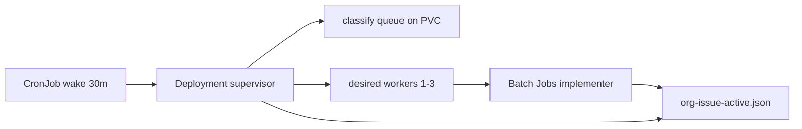

# Org-issue supervisor (Kubernetes)

Prototype for **Kubernetes-ready org-issue swarm**: a long-running supervisor on the engine cluster spawns isolated implementer Jobs while open org issues remain.

## Flow



1. **Wake CronJob** (`li-org-issue-supervisor-wake`, `*/30 * * * *`) runs `org-issue-supervisor.js wake` — scales Deployment `li-org-issue-supervisor` to 1 replica.
2. **Supervisor Deployment** loops while `total_open > 0`: refreshes `org-issue-queue.json`, reads/writes `org-issue-active.json` on PVC `li-agents-sprint-data`, spawns up to **3** implementer Jobs.
3. **Implementer Job** (one issue each): stub CLI claims issue, optional GitHub comment, audit JSONL, marks active entry completed.

## Scaling formula

`desiredWorkers = min(maxWorkers, max(1, ceil(openCount / 50)))` with `maxWorkers=3` (default).

| Open issues | Workers |
|-------------|---------|
| 0 | 0 (supervisor exits) |
| 1–50 | 1 |
| 51–100 | 2 |
| 101+ | 3 |

## Duplicate prevention

- PVC file `data/goal-directed-sprints/org-issue-active.json` with exclusive lock (`org-issue-active.lock`).
- `claimIssue()` writes `{issueRef → workerId, status}` before Job create; second worker skips refs already `claimed`/`running`.
- K8s Job names are unique; label `li-langverse.io/org-issue` + annotation with full `li-langverse/repo#N` ref.
- Implementer verifies its `--worker-id` matches the active entry before running.

## Apply (homelab)

```powershell
$env:KUBECONFIG = "C:\Users\Julian\.kube\config-homelab"
cd li-cursor-agents

kubectl apply -f deploy/k8s/engine/namespace.yaml
kubectl apply -f deploy/k8s/engine/pvc-sprint-data.yaml
kubectl apply -f deploy/k8s/engine/rbac-org-issue-supervisor.yaml
kubectl apply -f deploy/k8s/engine/configmap-org-issue-supervisor.yaml
kubectl apply -f deploy/k8s/engine/deployment-org-issue-supervisor.yaml
kubectl apply -f deploy/k8s/engine/cronjob-org-issue-supervisor-wake.yaml
```

Requires `li-agents-secrets` with `GH_TOKEN` (same as org-issue-worker).

## Stub vs real implementer

**Stub today:** `org-issue-implementer.js` logs claim, posts a marker GitHub comment, appends `org-issue-implement-audit.jsonl`, marks active entry completed.

**Real path:** wire `code_implementer` agent with issue body as goal; keep coordination + Job lifecycle unchanged.

## Verify

```bash
kubectl -n li-swarm get deploy,job,pod -l app=li-org-issue-supervisor
kubectl -n li-swarm logs deploy/li-org-issue-supervisor --tail=50
kubectl -n li-swarm get jobs -l li-langverse.io/managed-by=org-issue-supervisor
```
