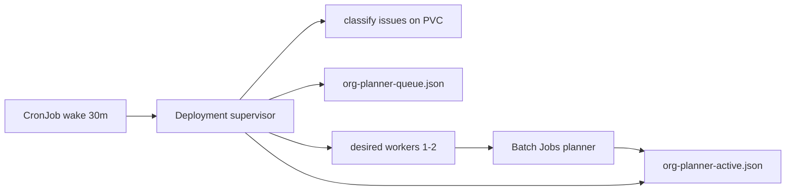

# Org-planner supervisor (Kubernetes)

Long-running supervisor on the engine cluster spawns isolated **issue_planner** Jobs from two lanes:

1. **issue_plan** — `route_planner` bucket in `org-issue-queue.json` (optionally `needs_triage`)
2. **research_plan** — `agent_handoffs` to `issue_planner` + goals missing `config/goal-scaffolds/{goalId}.md`

## Flow



## Scaling

`desiredWorkers = min(maxWorkers, max(1, ceil(openPlanItems / 25)))` with default `maxWorkers=2`.

Priority: **research_plan first**, then **issue_plan**.

## Apply (homelab)

```powershell
$env:KUBECONFIG = "C:\Users\Julian\.kube\config-homelab"
cd li-cursor-agents

kubectl apply -f deploy/k8s/engine/rbac-org-planner-supervisor.yaml
kubectl apply -f deploy/k8s/engine/configmap-org-planner-supervisor.yaml
kubectl apply -f deploy/k8s/engine/deployment-org-planner-supervisor.yaml
kubectl apply -f deploy/k8s/engine/cronjob-org-planner-supervisor-wake.yaml
```

Requires `li-agents-secrets`: `GH_TOKEN`, `CURSOR_API_KEY`, `SUPABASE_URL`, `SUPABASE_SERVICE_ROLE_KEY`.

## Env knobs

| Env | Default | Meaning |
|-----|---------|---------|
| `LI_ORG_PLANNER_SUPERVISOR_ENABLED` | `1` | Run supervisor |
| `LI_ORG_PLANNER_MAX_WORKERS` | `2` | Concurrent planner jobs |
| `LI_ORG_PLANNER_RESEARCH_ENABLED` | `1` | Lane B (research → plan) |
| `LI_ORG_PLANNER_INCLUDE_NEEDS_TRIAGE` | `0` | Also pull `needs_triage` issues |

## Downstream

- Issue plans → `plan-approved` label → next classify → **implement** bucket → issue supervisor
- Research plans → scaffold file → implement handoff → PR / code_implementer vertical
