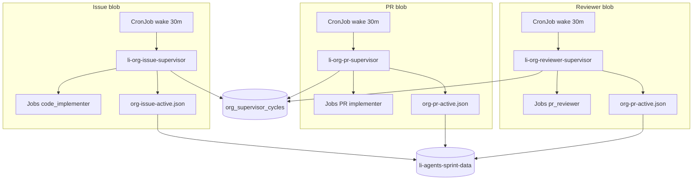

# Org PR + reviewer supervisors (Kubernetes)

Three parallel supervisor **blobs** on the homelab engine cluster share PVC coordination and optional Supabase cycle snapshots.

## Architecture



| Blob | Deployment | Wake CronJob | Worker Jobs | Queue source | Agent |
|------|------------|--------------|-------------|--------------|-------|
| Issue | `li-org-issue-supervisor` | `li-org-issue-supervisor-wake` | `li-org-impl-*` | `org-issue-queue.json` implement | `code_implementer` |
| PR | `li-org-pr-supervisor` | `li-org-pr-supervisor-wake` | `li-org-pr-impl-*` | `org-pr-merge-queue.json` dirty/ci_not_ok/blocked | `code_implementer` |
| Review | `li-org-reviewer-supervisor` | `li-org-reviewer-supervisor-wake` | `li-org-pr-rev-*` | green + blocked | `pr_reviewer` |

Scaling (PR + review): `desiredWorkers = min(maxWorkers, max(1, ceil(open/25)))` with `maxWorkers` up to **16** (`LI_ORG_PR_SUPERVISOR_MAX_WORKERS` / `LI_ORG_REVIEWER_SUPERVISOR_MAX_WORKERS`). Issue blob uses `ceil(open/50)` with its own cap.

## Coordination (`org-pr-active.json`)

Single PVC file under `data/goal-directed-sprints/`:

- One active row per `li-langverse/<repo>#<num>` with `role`: `implementer` | `reviewer`.
- Implementer and reviewer **cannot** claim the same PR while status is `claimed` or `running`.
- Reviewer supervisor skips PRs that are busy (e.g. implementer Job in flight).
- Audits: `org-pr-implement-audit.jsonl`, `org-pr-review-audit.jsonl`.

Issue blob keeps **`org-issue-active.json`** unchanged.

## Database (`org_supervisor_cycles`)

Migration: `supabase/migrations/20260531120000_org_supervisor_cycles.sql`

| Column | Purpose |
|--------|---------|
| `supervisor_kind` | `issue` \| `pr` \| `review` (PK) |
| `open_count` | Backlog size for scaling |
| `desired_workers` | Last computed worker target |
| `active_claims` | JSON array of in-flight PVC claims |
| `last_cycle_at` | Last successful tick |
| `last_error` | Classify/refresh failure tail |

Each supervisor calls `saveOrgSupervisorCycle()` after every tick when `LI_CONTROL_PLANE_STORE=supabase` and `SUPABASE_URL` + `SUPABASE_SERVICE_ROLE_KEY` are set (optional on `li-agents-secrets`). PVC remains source of truth for claims; DB is for visibility/dashboards.

## Apply (homelab)

```powershell
$env:KUBECONFIG = "C:\Users\Julian\.kube\config-homelab"
cd li-cursor-agents

kubectl apply -f deploy/k8s/engine/namespace.yaml
kubectl apply -f deploy/k8s/engine/pvc-sprint-data.yaml
kubectl apply -f deploy/k8s/engine/rbac-org-issue-supervisor.yaml
kubectl apply -f deploy/k8s/engine/rbac-org-pr-supervisor.yaml
kubectl apply -f deploy/k8s/engine/configmap-org-issue-supervisor.yaml
kubectl apply -f deploy/k8s/engine/configmap-org-pr-supervisor.yaml
kubectl apply -f deploy/k8s/engine/configmap-org-reviewer-supervisor.yaml
kubectl apply -f deploy/k8s/engine/deployment-org-issue-supervisor.yaml
kubectl apply -f deploy/k8s/engine/deployment-org-pr-supervisor.yaml
kubectl apply -f deploy/k8s/engine/deployment-org-reviewer-supervisor.yaml
kubectl apply -f deploy/k8s/engine/cronjob-org-issue-supervisor-wake.yaml
kubectl apply -f deploy/k8s/engine/cronjob-org-pr-supervisor-wake.yaml
kubectl apply -f deploy/k8s/engine/cronjob-org-reviewer-supervisor-wake.yaml
```

Secrets (`li-agents-secrets`): `GH_TOKEN`, `CURSOR_API_KEY` (required for real agent Jobs). Optional: `SUPABASE_URL`, `SUPABASE_SERVICE_ROLE_KEY` for DB sync.

## Verify

```bash
kubectl -n li-swarm get deploy,cronjob -l 'app in (li-org-issue-supervisor,li-org-pr-supervisor,li-org-reviewer-supervisor)'
kubectl -n li-swarm logs deploy/li-org-pr-supervisor --tail=40
kubectl -n li-swarm get jobs -l 'li-langverse.io/managed-by in (org-pr-supervisor,org-pr-reviewer-supervisor)'
```

## Local CLI

```bash
npm run agents:org-pr-supervisor
npm run agents:org-reviewer-supervisor
node dist/cli/org-pr-implementer.js --pr li-langverse/lic#1 --worker-id test --mock
```
