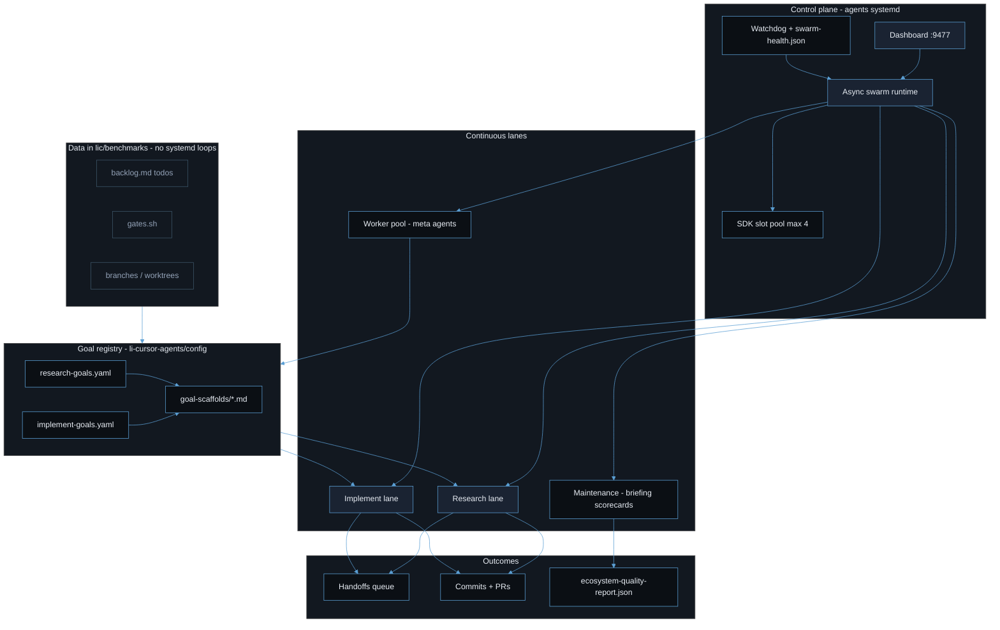

# Goal-directed swarm architecture

The Li async swarm replaces nine independent `lic` systemd plan loops with one control plane in **li-cursor-agents**. Goals live in YAML; backlogs and gate scripts stay in **lic** as data only.

## System diagram



Palette: `#0B0F14` background, `#5B9FD4` accent, `#E8EDF4` text, `#94A3B8` muted.

## Operator guide

### Self-driving install (only entry point)

Do **not** install or enable `lic` plan-loop systemd units (`li-httpd-plan-loop`, `li-sim-algo-plan-loop`, etc.). Those loops are retired; backlogs and gates in `lic` remain as files only.

Single entry for a persistent self-driving swarm:

```bash
cd li-cursor-agents
source ~/Documents/Cursor/.env   # CURSOR_API_KEY, GH_TOKEN
./scripts/install-agents-swarm-systemd.sh
```

This installs user systemd for the dashboard (`:9477`, `LI_AUTO_START_ASYNC_SWARM=1`) plus optional async-swarm and watchdog. Stop autostart: `touch data/control-plane/DISABLE_AUTOSTART`.

Foreground dev: `npm run agents:async-swarm` or `./scripts/keep-agents-running.sh`.

Retiring old units (data preserved): in `lic`, `./scripts/retire-goal-plan-loops.sh` (see `--apply` in script help).

## How lanes consume goals

### Research lane

1. Loads `config/research-goals.yaml`.
2. Picks the next eligible goal via cadence and priority (`pickNextGoal` / `pickNextGoalForAgent`).
3. Uses `config/goal-scaffolds/<id>.md` and optional research-session continuity.
4. Runs the configured `agent`; may enqueue handoffs for implement agents.

### Implement lane

1. **Handoffs first** from the handoff store (`package_architect`, `code_implementer`).
2. If idle: `config/implement-goals.yaml` → `pickNextImplementGoalForAgent` → next open backlog todo → `runAgent` → `gates_script` under `lic`.
3. Gate pass marks todos complete and updates `implement_goal_last_run_at` in lane state.

### Worker pool

Meta agents run on staggered intervals. `pickNextWorkForAgent` reads `GET /api/queue` and prefers work aligned with active research goals when available.

Maintenance lane refreshes briefing and scorecards without LLM SDK slots.

## Goal registry and API

| File | Lane |
|------|------|
| `config/research-goals.yaml` | Research |
| `config/implement-goals.yaml` | Implement |
| `config/goal-scaffolds/*.md` | Shared scaffolds |

Read-only board: `GET /api/goals` (YAML only, no DB).

## SDK slots

Research (1) + implement (1) + worker pool (2) = default `LI_SDK_MAX_CONCURRENT=4`. Details: [sdk-slot-policy.md](./sdk-slot-policy.md).

## Related docs

- [agent-automations.md](./agent-automations.md)
- [sdk-slot-policy.md](./sdk-slot-policy.md)
- `lic/.cursor/skills/goal-plan-loop-persistent/SKILL.md` — **deprecated**; use this doc
