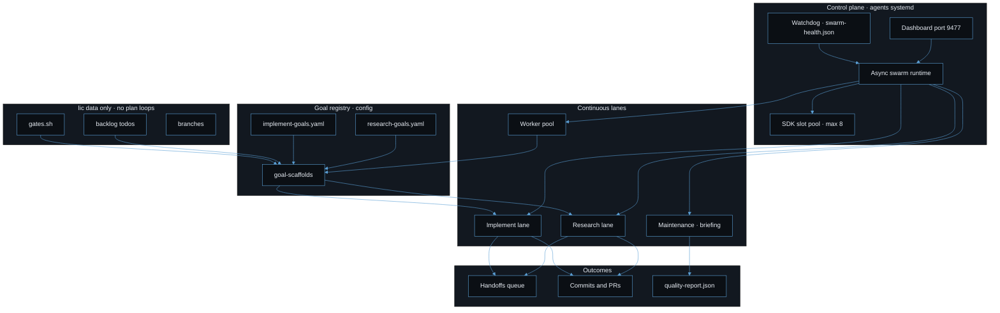

# Goal-directed swarm architecture

The Li async swarm replaces nine independent `lic` systemd plan loops with one control plane in **li-cursor-agents**. Goals live in YAML; backlogs and gate scripts stay in **lic** as data only.

## Conceptual view

**One sentence:** You declare *what* should improve (goals); the swarm decides *who* runs next and *when*, within a fixed budget of parallel AI sessions; the repo only moves forward when automated gates say it is safe.

Think of four layers, bottom to top:

| Layer | Question it answers | You touch it… |
|-------|---------------------|---------------|
| **Codebase** | What changed? | Via PRs the agents open |
| **Agents** | Who does the work? | Rarely — registry + prompts |
| **Swarm** | Who runs next, how many at once? | Start/stop dashboard |
| **Goals** | What are we trying to achieve? | YAML + backlogs in `lic` |

The loop is continuous: **read signals → pick highest-value goal → run agent → verify with gates → ship or retry → update briefing → repeat.**

```
                    ┌─────────────────────────────────────┐
                    │  NORTH STAR                         │
                    │  benchmarks · quality report · gaps │
                    └──────────────────┬──────────────────┘
                                       │ informs
                    ┌──────────────────▼──────────────────┐
                    │  GOALS                              │
                    │  "improve httpd" · "research MD"    │
                    │  research-goals + implement-goals   │
                    └──────────────────┬──────────────────┘
                                       │ schedules
                    ┌──────────────────▼──────────────────┐
                    │  SWARM                              │
                    │  research · implement · audit lanes │
                    │  ≤8 parallel SDK sessions         │
                    └──────────────────┬──────────────────┘
                                       │ produces
                    ┌──────────────────▼──────────────────┐
                    │  CODEBASE                           │
                    │  commits · PRs · passing gates      │
                    └──────────────────┬──────────────────┘
                                       │
                                       └────── feedback ──────┘
```

**X infographic (brand colors):** [swarm-infographic.html](./swarm-infographic.html) — 1200×675 artboard (16:9), **Download PNG for X** via html2canvas, optional 1600×900. Flow: Signals → Goals → Swarm (8 slots) → Agents → Codebase + feedback; **9 lic loops → 1 swarm**.

**Old model (retired):** nine separate bash loops in `lic`, each fighting for the same SDK slots.

**New model:** one swarm reads the same goals and backlogs; `lic` is where plans and gate scripts live, not where processes run.

---

## Technical diagram (Mermaid)

For implementers who need node-level detail:



Palette: `#0B0F14` background, `#5B9FD4` accent, `#E8EDF4` text, `#94A3B8` muted.

## Operator guide

### Self-driving install (only entry point)

Do **not** install or enable `lic` plan-loop systemd units (`li-httpd-plan-loop`, `li-sim-algo-plan-loop`, etc.). Those loops are retired; backlogs and gates in `lic` remain as files only.

Single entry for a persistent self-driving swarm:

```bash
cd li-cursor-agents
source ~/Documents/Cursor/.env   # CURSOR_API_KEY, GH_TOKEN
./scripts/install-agents-swarm-systemd.sh
```

This installs user systemd for the dashboard (`:9477`, `LI_AUTO_START_ASYNC_SWARM=0` when async-swarm is installed) plus `li-agents-async-swarm` and watchdog. Only the async-swarm unit runs the swarm process; the dashboard serves API/UI. Stop autostart: `touch data/control-plane/DISABLE_AUTOSTART`.

**LAN access (other machines on your network):** by default the ops-server binds to loopback (`127.0.0.1`). To expose the dashboard API and static UI on the LAN:

```bash
# One-shot install with LAN bind
./scripts/install-agents-swarm-systemd.sh --lan
systemctl --user restart li-agents-dashboard.service
```

Or set `LI_AGENT_DASHBOARD_HOST=0.0.0.0` in `~/Documents/Cursor/.env` (or project `.env`) before install/restart. Open from another host: `http://<this-machine-ip>:9477/` (`hostname -I` for the IP). If `ufw` is active: `sudo ufw allow 9477/tcp` (or your `LI_AGENT_DASHBOARD_PORT`). Binding `0.0.0.0` exposes the control plane to anyone who can reach the port — use only on trusted networks.

Foreground dev: `npm run agents:async-swarm` or `./scripts/keep-agents-running.sh` (honors `LI_AGENT_DASHBOARD_HOST` from env).

Retiring old units (data preserved): in `lic`, `./scripts/retire-goal-plan-loops.sh` (see `--apply` in script help).

## How lanes consume goals

### Research lane

1. Loads `config/research-goals.yaml`.
2. Picks the next eligible goal via cadence and priority (`pickNextGoal` / `pickNextGoalForAgent`).
3. Uses `config/goal-scaffolds/<id>.md` and optional research-session continuity.
4. Runs the configured `agent`; may enqueue handoffs for implement agents.

### Implement lane

1. **Handoffs first** from the handoff store (`package_architect`, `code_implementer`).
2. If idle: `config/implement-goals.yaml` → `pickNextImplementGoalForAgent` → next open backlog todo → `runAgent` → `gates_script` under `lic`.
3. Gate pass marks todos complete and updates `implement_goal_last_run_at` in lane state.

### Worker pool

Meta agents run on staggered intervals. `pickNextWorkForAgent` reads `GET /api/queue` and prefers work aligned with active research goals when available.

Maintenance lane refreshes briefing and scorecards without LLM SDK slots.

## Goal registry and API

| File | Lane |
|------|------|
| `config/research-goals.yaml` | Research |
| `config/implement-goals.yaml` | Implement |
| `config/goal-scaffolds/*.md` | Shared scaffolds |

Read-only board: `GET /api/goals` (YAML only, no DB).

## SDK slots

Research (1) + implement (1) + worker pool (6) = default `LI_SDK_MAX_CONCURRENT=8`. Details: [sdk-slot-policy.md](./sdk-slot-policy.md).

## Hung-agent sweep

Crashed workers can leave stale SDK slot files or orphan `run-agent` / `async-swarm` processes. The sweep reclaims locks and stops stuck PIDs without killing the dashboard or systemd swarm:

```bash
./scripts/sweep-hung-agents.sh          # dry-run
./scripts/sweep-hung-agents.sh --apply
```

Timer: `li-agents-sweep.timer` (30m) from `install-agents-swarm-systemd.sh`. See [hung-agent-sweep.md](./hung-agent-sweep.md).

## Related docs

- [agent-automations.md](./agent-automations.md)
- [sdk-slot-policy.md](./sdk-slot-policy.md)
- [hung-agent-sweep.md](./hung-agent-sweep.md)
- `lic/.cursor/skills/goal-plan-loop-persistent/SKILL.md` — **deprecated**; use this doc
