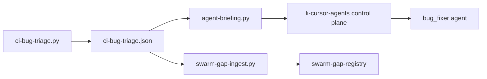

# Swarm-scoped CI fixer

How `bug_fixer` stays scoped to agent PRs while the org-wide CI backlog remains visible.

## Data flow



## Triage queues

`benchmarks/scripts/ci-bug-triage.py` writes:

| Field | Contents |
|-------|----------|
| `org_work_queue` | All local-ci failures, bug issues, GHA-red open PRs (cap 40) |
| `swarm_work_queue` | Subset where `is_agent_pr` and `kind` ∈ `{pr_ci, local_ci}` |
| `work_queue` | Bug-fixer dispatch: swarm when non-empty and `LI_BUG_FIXER_SWARM_ONLY=1`; else org fallback |

Rows are enriched with `head_ref`, `originating_agent_id`, `is_agent_pr`, and optional `goal_id` (from PR body / branch naming).

Agent detection matches `pr-merge-gate.py` (`_is_likely_agent_pr`): labels (`cursor-agent`, `li-agent`, …), `chore/agent-*` branches, `<!-- li-agent -->` body markers.

## Environment

| Variable | Default | Effect |
|----------|---------|--------|
| `LI_BUG_FIXER_SWARM_ONLY` | `1` | Control plane + triage prefer `swarm_work_queue` |
| `LI_BUG_FIXER_SWARM_ONLY=0` | — | Merge swarm + org + legacy `work_queue` (cap 8) |

See `li-cursor-agents/.env.example` and `src/preflight/ci-bug-triage-queue.ts`.

## Verify locally

```bash
# 1. Regenerate triage
cd benchmarks
python3 scripts/ci-bug-triage.py

# 2. Inspect counts
python3 - <<'PY'
import json
from pathlib import Path
d = json.loads(Path("data/latest/ci-bug-triage.json").read_text())
s = d["summary"]
print("org=", s["org_work_queue_size"], "swarm=", s["swarm_work_queue_size"],
      "bug_fixer_queue=", s["work_queue_size"], "swarm_only=", d["bug_fixer_swarm_only"])
for r in d.get("swarm_work_queue", [])[:5]:
    print(f"  {r['repo']}#{r['number']} agent={r.get('originating_agent_id')} head={r.get('head_ref')}")
PY

# 3. Briefing recommends bug_fixer from swarm (not code_implementer for pr_ci-only)
python3 scripts/agent-briefing.py --skip-slow
grep -A2 bug_fixer data/latest/agent-briefing.json | head

# 4. Gap registry ingest (lic)
cd ../lic
python3 scripts/swarm-gap-ingest.py --dry-run | grep ci_blocked

# 5. Control-plane unit tests (li-cursor-agents, branch fix/swarm-ci-dispatch+)
cd ../li-cursor-agents
npm test -- src/preflight/ci-bug-triage-queue.test.ts
```

## Expected signals

- `swarm_work_queue_size` ≤ `org_work_queue_size`
- When swarm non-empty: `work_queue_size == swarm_work_queue_size` and briefing cites `swarm_work_queue`
- `code_implementer` recommended only for `issue` / `local_ci` rows, not pr_ci-only backlog
- Registry gap `gap-ci-blocked-swarm-pr` open when swarm queue non-empty; closed when empty

## Handoffs

After `code_implementer` opens a PR with red CI, `enqueueSwarmCiBugFixerHandoff` (`src/handoffs/swarm-ci-bug-handoff.ts`) creates a pending handoff to `bug_fixer` with `originating_agent_id` and `goal_id`.
