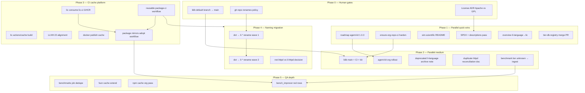

# Org hygiene + CI cache — multi-agent execution plan

**Date:** 2026-05-25  
**Status:** Ready for dispatch  
**Sources:** Org compliance audit (31 repos) + CI cache audit (32 repos) — synthesized, not re-audited  
**Repo:** [li-cursor-agents](https://github.com/li-langverse/li-cursor-agents) (plan only; **no bulk lic rebuild here**)

## Executive summary

Two audits converge on **platform unblockers** (human-gated renames/branches), **parallel hygiene PRs** (agent-kit, SPDX, descriptions, lidb), then **lic CI platform work** (consume `ghcr.io/li-langverse/lic-ci`, `actions/cache`, reusable `package-ci`) before **naming migration** and **benchmarks depth**. Max **10 leaf agents** per coordinator heap; serialize same-repo WPs.

## Agent constraints (embed in every WP brief)

| Rule | Detail |
|------|--------|
| **PR-only** | Feature branch → PR → CI green → **stop** (no `gh pr merge`) |
| **Release notes** | Merge-worthy changes: `CHANGELOG.md` `[Unreleased]` + `docs/release-notes/YYYY-MM-DD-<slug>.md` per `li-release-notes.mdc` |
| **Human gates** | Default branch rename, `gh repo rename`, org-wide license ADR — **Phase 0 / 4** only with human approval |
| **Isolated clones** | `prompts/repo-workflow-tools.md`: `prepare` → edit → `commit-pr`; never dirty sibling checkouts |
| **li-cursor-agents** | **IGNORE** in org sweeps / bulk lic mirror rebuilds; only agent-kit sync when roadmap bumps |
| **No schedule cron** | Per `docs/ecosystem/actions-budget.md` in benchmarks |
| **Hooks** | Never `--no-verify`; never weaken `agent-kit/hooks/guard-*.sh` |

## Dependency diagram



## Agent dispatch table

**Max concurrent leaf agents:** 10 (`coord_platform` + `coord_ecosystem` split below).

| Agent slot | Profile | Parallel group | Work packages |
|------------|---------|----------------|---------------|
| **A1** | `agent_kit_maintainer` | G1 | WP-A1 |
| **A2** | `ci_maintainer` | G1 | WP-A2, WP-B2 (after A1 if same repo — else parallel different repos) |
| **A3** | `docs_maintainer` | G1 | WP-A3, WP-A5 |
| **A4** | `repo-workflow implementer` | G1 | WP-A4 (multi-repo SPDX/descriptions) |
| **A5** | `bench_improver` / benchmarks maintainer | G1 | WP-A6 |
| **B1** | `ci_maintainer` | G2 | WP-B1 (lidb only — **serialize**) |
| **B2** | `agent_kit_maintainer` | G2 | WP-B2 (after WP-A1) |
| **B3** | `docs_maintainer` | G2 | WP-B3, WP-B4 |
| **B4** | `ecosystem health` / gap_explorer | G2 | WP-B5 |
| **C1** | `ci_maintainer` (lic specialist) | G3 | WP-C1, WP-C2 (**serialize lic**) |
| **C2** | `ci_maintainer` | G3 | WP-C3, WP-C4 (after C1) |
| **C3** | `ci_maintainer` | G3 | WP-C5, WP-C6 (after C3 workflow lands) |
| **D1–D3** | Human + `docs_maintainer` | G4 | WP-D* (human opens renames; agent docs only) |
| **E1** | `ci_maintainer` | G5 | WP-E1, WP-E2 |
| **E2** | `ci_maintainer` | G5 | WP-E3 |
| **E3** | `bench_improver` | G5 | WP-E4 |

**Serialization rule:** Same repo → one agent; lic Phase 3 → single **C1** slot.

---

## Phase 0 — Unblockers (human-gated)

| ID | Title | Owner | Repos | Prerequisites | Parallel group | Conflict risk |
|----|-------|-------|-------|---------------|----------------|---------------|
| **WP-H0** | lidb default branch → `main` | Human (+ `ci_maintainer` for CI PR after) | `lidb` | — | H0 | **same-repo serialize** |
| **WP-H1** | Naming policy: dot repos → `li-*` | Human (org settings) | many | WP-H2 doc optional | H0 | none (human only) |
| **WP-H2** | License policy ADR (Apache org vs lis GPL vs lic no LICENSE) | Human (`roadmap` proposal) | `roadmap`, `lic`, `lis` | — | H0 | governance serialize |

### WP-H0 — lidb → main

**Owner:** Human (branch rename); then `ci_maintainer`  
**Tasks:**
1. Human: GitHub Settings → default branch `main`; retire orphan default if not `main`.
2. Agent (after H0): isolated clone `lidb` → add `.github/workflows/ci.yml` from `lic/scripts/templates/github-repo/ci.yml`.
3. Run `../roadmap/scripts/install-agent-kit.sh` (or repo `sync-agent-kit.sh`).

**Verification:**
```bash
gh repo view li-langverse/lidb --json defaultBranchRef
cd benchmarks && python3 scripts/ensure-org-repo-ci.py | jq '.repos[]|select(.name=="lidb")'
python3 scripts/ensure-org-agent-kit.py --local-only | jq '.drifted[]|select(.repo=="lidb")'
```

**Deliverable:** `https://github.com/li-langverse/lidb/pull/<n>` + green required checks on `main`.

---

### WP-H1 — Repo rename policy

**Owner:** Human  
**Tasks:**
1. Human: approve rename list (dot repos vs `li-*` policy from audit).
2. File checklist in `roadmap/docs/ecosystem/` (human PR).

**Verification:** `gh repo list li-langverse --limit 100` matches approved names.

**Deliverable:** ADR/checklist merged in `roadmap` (human merge).

---

### WP-H2 — License ADR

**Owner:** Human (`roadmap`)  
**Tasks:**
1. Human: merge proposal — Apache-2.0 org default; exceptions (`lis` GPL, `lic` LICENSE file).
2. No agent SPDX mass-edit until ADR merged.

**Verification:** proposal PR checks + label `plan-approved`.

**Deliverable:** merged ADR in `roadmap/docs/` or `proposals/`.

---

## Phase 1 — Parallel quick wins (no cross-repo deps)

**Start:** immediately (except WP-A4 if blocked on WP-H2).

| ID | Title | Owner | Repos | Prerequisites | Parallel group | Conflict risk |
|----|-------|-------|-------|---------------|----------------|---------------|
| **WP-A1** | Roadmap agent-kit 1.3.2 → 1.3.3 | `agent_kit_maintainer` | `roadmap` | — | G1 | same-repo |
| **WP-A2** | Harden `ensure-org-repo-ci.py` (lidb false positives) | `repo-workflow implementer` | `benchmarks` | — | G1 | none |
| **WP-A3** | sim.scientific empty README | `docs_maintainer` | `sim.scientific` | — | G1 | none |
| **WP-A4** | SPDX + GitHub descriptions SEO pass | `docs_maintainer` | org subset (~10/repo wave) | WP-H2 for license file edits | G1 | low (multi-repo) |
| **WP-A5** | overview.md: li-language → lic | `docs_maintainer` | `roadmap` or `benchmarks` | — | G1 | none |
| **WP-A6** | Merge tier-db-registry open PR | `bench_improver` | `benchmarks` | — | G1 | same-repo |

### WP-A1 — Roadmap agent-kit bump

**Tasks:**
1. `cd roadmap && ./scripts/bump-agent-kit.sh` (or manifest edit `agent-kit/manifest.toml` → 1.3.3).
2. Human-merge governance PR (agent opens only).

**Verification:**
```bash
grep version roadmap/agent-kit/manifest.toml
cd benchmarks && python3 scripts/ensure-org-agent-kit.py --local-only
```

**Deliverable:** `roadmap` PR + `org-agent-kit-audit.json` shows canonical 1.3.3.

---

### WP-A2 — ensure-org-repo-ci harden

**Tasks:**
1. Edit `benchmarks/scripts/ensure-org-repo-ci.py` — exclude lidb until on `main` OR detect default branch correctly.
2. Add regression fixture under `benchmarks/tests/` if present.
3. Commit audit JSON only if repo policy allows.

**Verification:**
```bash
cd benchmarks && python3 -m pytest tests/ -k ensure_org_repo_ci -q 2>/dev/null || python3 scripts/ensure-org-repo-ci.py
python3 scripts/ensure-org-repo-ci.py | jq '[.repos[]|select(.name=="lidb")][0]'
```

**Deliverable:** `benchmarks` PR; lidb no longer false-positive `missing_ci_on_main` when appropriately gated.

---

### WP-A3 — sim.scientific README

**Tasks:**
1. Isolated clone → minimal README (purpose, link to `sim`, build/run one-liner).
2. Release notes if public-facing.

**Verification:** `gh repo view li-langverse/sim.scientific --json description,readme`

**Deliverable:** `sim.scientific` PR.

---

### WP-A4 — SPDX + descriptions

**Tasks:**
1. Wave 1 (~8 repos): empty/template descriptions from audit list.
2. Add `LICENSE` or `SPDX-License-Identifier` per **merged** WP-H2 ADR only.
3. Skip `lic` LICENSE until ADR; document in PR **Not changed**.

**Verification:**
```bash
cd benchmarks && python3 scripts/ecosystem-audit.py
jq '.gaps.license_inconsistency, .gaps.empty_descriptions' data/latest/ecosystem-audit.json
```

**Deliverable:** 1 PR per repo (parallel agents) or batched per repo policy.

---

### WP-A5 — overview li-language → lic

**Tasks:**
1. Find `overview.md` reference (audit: deprecated `li-language`).
2. Replace links/text with `lic`; add redirect note in `li-language` README (Phase 2 WP-B3).

**Verification:** `rg -n 'li-language' roadmap benchmarks --glob '*.md'`

**Deliverable:** `roadmap` or `benchmarks` docs PR.

---

### WP-A6 — tier-db-registry merge

**Tasks:**
1. `gh pr view` open tier-db-registry PR from audit.
2. Rebase if needed; ensure CI green; **do not self-merge**.

**Verification:**
```bash
gh pr checks <number> --repo li-langverse/benchmarks
npm run ci:local  # if touching benchmarks from li-cursor-agents overlay
```

**Deliverable:** PR ready for human merge; `data/latest/summary.json` registry row populated post-merge.

---

## Phase 2 — Parallel medium (may need Phase 0)

| ID | Title | Owner | Repos | Prerequisites | Parallel group | Conflict risk |
|----|-------|-------|-------|---------------|----------------|---------------|
| **WP-B1** | lidb main + CI + agent-kit | `ci_maintainer` | `lidb` | WP-H0 | G2 | **same-repo serialize** |
| **WP-B2** | Org agent-kit rollout | `agent_kit_maintainer` | drifted repos (audit list) | WP-A1 merged | G2 | multi-repo parallel |
| **WP-B3** | li-language deprecation archive | `docs_maintainer` | `li-language`, `lic` | WP-A5 | G2 | none |
| **WP-B4** | net.httpd vs li-httpd reconciliation | `docs_maintainer` | `roadmap`, `net.httpd`, `li-httpd` | — | G2 | none |
| **WP-B5** | Benchmark tiers unknown → ingest | `bench_improver` | `benchmarks`, `lic` | — | G2 | none |

### WP-B1 — lidb CI + kit

**Tasks:**
1. After WP-H0: WP-B1 CI workflow + branch protection alignment.
2. `./scripts/sync-agent-kit.sh` or `install-agent-kit.sh` from roadmap.
3. `AGENTS.md` pointers.

**Verification:** same as WP-H0 agent checks + `li-tests`/`lit` if lidb has native CI commands in repo README.

**Deliverable:** lidb PR(s) on `main`.

---

### WP-B2 — Agent-kit org rollout

**Tasks:**
1. `npm run repo-workflow -- agent-kit-rollout --dry-run` from li-cursor-agents OR `rolloutAgentKitPrs` via control plane.
2. Per failing repo: isolated clone → install → PR `chore(agent-kit): sync v1.3.3`.

**Verification:**
```bash
python3 ../benchmarks/scripts/ensure-org-agent-kit.py --local-only
# expect downstream_adoption green for all non-ignored repos
```

**Deliverable:** N PRs `https://github.com/li-langverse/<repo>/pull/<n>`; **exclude li-cursor-agents** from bulk lic rebuild.

---

### WP-B3 — li-language deprecation

**Tasks:**
1. `li-language` README: archived → use `lic`.
2. Optional GitHub archive flag (human).

**Verification:** `gh repo view li-langverse/li-language`

**Deliverable:** `li-language` PR + cross-link in `lic` docs if needed.

---

### WP-B4 — httpd duplicate reconciliation

**Tasks:**
1. Doc decision table in `roadmap/docs/ecosystem/`: canonical `li-httpd` vs legacy `net.httpd`.
2. No code delete until human approves.

**Verification:** PR review from human; no duplicate publish paths in `lip` registry (grep).

**Deliverable:** `roadmap` PR (human merge).

---

### WP-B5 — Tier registry unknown → ingest

**Tasks:**
1. Run benchmarks ingest scripts for repos with `tier: unknown` in audit.
2. Open **lic** PR only if harness/compiler fix required (PH-7e); else benchmarks data PR.

**Verification:**
```bash
cd benchmarks && ./scripts/ingest/ingest-lic.sh  # if CSV exists
jq '.benchmarks[]|select(.status=="unknown")' data/latest/summary.json | head
```

**Deliverable:** benchmarks PR updating `data/latest/` + dashboard row.

---

## Phase 3 — CI/cache platform (blocks package fleet)

**Single lic editor at a time** (serialize WP-C1→C5 on `lic`).

| ID | Title | Owner | Repos | Prerequisites | Parallel group | Conflict risk |
|----|-------|-------|-------|---------------|----------------|---------------|
| **WP-C1** | lic CI: consume `ghcr.io/li-langverse/lic-ci` | `ci_maintainer` (lic) | `lic` | — | G3 | **same-repo serialize** |
| **WP-C2** | lic `actions/cache` on build/ | `ci_maintainer` (lic) | `lic` | WP-C1 | G3 | same-repo |
| **WP-C3** | Reusable `package-ci` workflow | `ci_maintainer` (lic) | `lic` | WP-C2 | G3 | same-repo |
| **WP-C4** | LLVM 22 alignment across workflows | `ci_maintainer` (lic) | `lic` | WP-C3 | G3 | same-repo |
| **WP-C5** | Docker publish cache | `ci_maintainer` (lic) | `lic` | WP-C2 | G3 | same-repo |
| **WP-C6** | ~15 package mirrors adopt reusable CI | `ci_maintainer` | `li-*` mirrors | WP-C3 | G3 | parallel across repos |

### WP-C1 — Consume lic-ci GHCR image

**Tasks:**
1. `.github/workflows/ci.yml` (or main CI workflow): `container: ghcr.io/li-langverse/lic-ci:<tag>` matching published image.
2. Remove redundant cold toolchain install steps superseded by image.

**Verification:**
```bash
gh run list --repo li-langverse/lic --limit 3
gh run view <id> --log | rg -i 'ghcr.io/li-langverse/lic-ci|pulling'
```

**Deliverable:** `lic` PR; CI duration drop vs baseline (note in release notes).

---

### WP-C2 — actions/cache on lic build

**Tasks:**
1. Add `actions/cache@v4` for `build/`, Lean cache paths per audit.
2. Document cache keys in `lic/docs/ci.md` or engineering standards cross-link.

**Verification:**
```bash
rg 'actions/cache' lic/.github/workflows/
gh pr checks <lic-pr>
```

**Deliverable:** `lic` PR; second CI run shows cache hit.

---

### WP-C3 — Reusable package-ci workflow

**Tasks:**
1. Add `lic/.github/workflows/package-ci.yml` (`workflow_call`).
2. `./scripts/ensure-package-ci.sh` green locally.
3. Release notes: **Downstream** — mirrors must pin `@main` or version tag.

**Verification:**
```bash
cd lic && ./scripts/ensure-package-ci.sh
```

**Deliverable:** `lic` PR merging reusable workflow.

---

### WP-C4 — LLVM 22 alignment

**Tasks:**
1. Align matrix LLVM version to 22 in lic + template `ci.yml`.
2. Update `lic/scripts/templates/github-repo/ci.yml`.

**Verification:** workflow YAML `llvm-version: 22` (or container ships 22).

**Deliverable:** included in lic CI PR stack or follow-up PR after C3.

---

### WP-C5 — Docker publish cache

**Tasks:**
1. `docker/build-push-action` with GHA cache or registry cache for lic-ci image build job.

**Verification:** image publish job logs show cache reuse.

**Deliverable:** `lic` PR (may stack with C1).

---

### WP-C6 — Package mirror fleet

**Tasks:**
1. Per mirror (~15): replace inline lic cold-build with:
   ```yaml
   uses: li-langverse/lic/.github/workflows/package-ci.yml@<sha>
   ```
2. One PR per package repo (parallel agents, different repos).

**Verification:**
```bash
cd lic && ./scripts/ensure-package-ci.sh
# per mirror:
gh run list --repo li-langverse/<package> --limit 2
```

**Deliverable:** fleet of package PRs; audit shows `actions/cache` + reusable workflow adoption.

**Note:** **Do not** assign bulk work to `li-cursor-agents`; quota already light.

---

## Phase 4 — Naming migration (human-gated, many repos)

| ID | Title | Owner | Repos | Prerequisites | Parallel group | Conflict risk |
|----|-------|-------|-------|---------------|----------------|---------------|
| **WP-D1** | Rename wave 1 (low coupling) | Human rename + `docs_maintainer` | dot repos subset | WP-H1 | G4 | human gate |
| **WP-D2** | Rename wave 2 (dependent pkgs) | Human + agents update pins | mirrors, `lip` | WP-D1, WP-C6 | G4 | cross-repo |
| **WP-D3** | net.httpd / li-httpd canonical name | Human | per WP-B4 decision | WP-B4 | G4 | human gate |

### WP-D1 — Rename wave 1

**Tasks:**
1. Human: `gh repo rename` per approved list.
2. Agent: update `roadmap/.github/li-org-repos.txt`, benchmarks ingest paths, `lip` registry URLs.

**Verification:**
```bash
gh repo list li-langverse | rg '<old-name>'
cd benchmarks && python3 scripts/ecosystem-audit.py
```

**Deliverable:** `roadmap` + `benchmarks` PRs; no agent rename without human.

---

### WP-D2 — Rename wave 2 + pin updates

**Tasks:**
1. Dependabot/`go.mod`/`Cargo.toml` pin updates across mirrors.
2. `./scripts/ingest/*` path fixes in benchmarks.

**Verification:** `rg 'github.com/li-langverse/<old>' ../` → empty.

**Deliverable:** multi-repo PR series (parallel by repo).

---

### WP-D3 — httpd canonical repo

**Tasks:** execute WP-B4 decision (archive duplicate or redirect).

**Verification:** single canonical package in registry ingest.

---

## Phase 5 — QA / benchmarks depth

| ID | Title | Owner | Repos | Prerequisites | Parallel group | Conflict risk |
|----|-------|-------|-------|---------------|----------------|---------------|
| **WP-E1** | Collapse benchmarks duplicate CI jobs | `ci_maintainer` | `benchmarks` | WP-A6 | G5 | same-repo |
| **WP-E2** | Extend fuzz cache | `ci_maintainer` | `lic` | WP-C2 | G5 | lic serialize |
| **WP-E3** | npm cache pass (dashboard-ui, etc.) | `ci_maintainer` | `ui`, others | — | G5 | none |
| **WP-E4** | bench_improver red dashboard rows | `bench_improver` | `lic` | WP-B5, WP-C6 | G5 | lic serialize |

### WP-E1 — Benchmarks job dedupe

**Tasks:**
1. Merge duplicate workflow jobs identified in CI cache audit.
2. Keep required checks for branch protection.

**Verification:**
```bash
gh workflow list --repo li-langverse/benchmarks
gh pr checks <pr>
```

**Deliverable:** `benchmarks` PR.

---

### WP-E2 — Fuzz cache extend

**Tasks:**
1. Extend `actions/cache` scopes for fuzz targets in `lic`.

**Verification:** second fuzz job cache hit in logs.

**Deliverable:** `lic` PR (after C2).

---

### WP-E3 — npm cache org pass

**Tasks:**
1. `actions/setup-node` + `cache: npm` in `ui`, `li-cursor-agents/dashboard-ui` only if scoped — **li-cursor-agents** minimal touch.

**Verification:** `rg 'cache.*npm' <repo>/.github`

**Deliverable:** per-repo PRs.

---

### WP-E4 — Red bench rows

**Tasks:**
1. Read `benchmarks/data/latest/summary.json` red rows.
2. `bench_improver` → lic fix PR (compiler/harness), not threshold tweaks in benchmarks.

**Verification:**
```bash
jq '[.benchmarks[]|select(.status=="fail")]' benchmarks/data/latest/summary.json
# after fix: ingest + green row on dashboard
```

**Deliverable:** `lic` PR + benchmarks ingest PR.

---

## Parallel vs sequential schedule (Gantt-style)

| Week slot | Parallel (same group) | Sequential gate |
|-----------|----------------------|-----------------|
| **W0** | — | Human: WP-H0, WP-H1, WP-H2 |
| **W1** | G1: WP-A1…A6 (6 agents) | WP-A4 license edits wait WP-H2 |
| **W2** | G2: WP-B2,B3,B4,B5 parallel; **one** agent on WP-B1 | WP-B1 after WP-H0; WP-B2 after WP-A1 |
| **W3–W4** | G3: **one** lic agent WP-C1→C5; WP-C6 fan-out (≤8 agents) | C6 after C3 |
| **W5+** | G4 human+docs; G5 after C6 | D2 after D1+C6 |

## Audit gap → WP mapping

| Audit finding | Work package |
|---------------|--------------|
| lidb not on main, no CI/kit | WP-H0, WP-B1 |
| roadmap agent-kit 1.3.2→1.3.3 | WP-A1, WP-B2 |
| ensure-org-repo-ci lidb false positive | WP-A2 |
| dot vs li-* policy | WP-H1, WP-D1, WP-D2 |
| sim.scientific empty README | WP-A3 |
| license inconsistency | WP-H2, WP-A4 |
| empty descriptions | WP-A4 |
| overview li-language | WP-A5, WP-B3 |
| tier-db-registry PR | WP-A6 |
| 0 actions/cache; lic-ci not consumed | WP-C1–C6, WP-E2 |
| ~15 package mirrors cold-build | WP-C6 |
| benchmarks duplicate jobs | WP-E1 |
| benchmark tiers unknown | WP-B5, WP-E4 |
| duplicate net.httpd / li-httpd | WP-B4, WP-D3 |
| li-cursor-agents quota-light | **no WP** (ignore sweeps) |

## Agent continuation

1. **Read:** this file; `prompts/ci-maintainer.md`; `prompts/agent-kit-maintainer.md`; `../benchmarks/data/latest/ecosystem-audit.json` (if present).
2. **Run:** Phase 1 audits:
   ```bash
   cd ../benchmarks
   python3 scripts/ensure-org-agent-kit.py --local-only
   python3 scripts/ensure-org-repo-ci.py
   python3 scripts/ecosystem-audit.py
   ```
3. **Dispatch:** assign slots from **Agent dispatch table**; max 10 leaf agents; respect **same-repo serialize**.
4. **Blocked on:** WP-H0/H1/H2 human merges before lidb CI mass-edit, SPDX license files, repo renames.

## References

- `AGENTS.md`, `README.md` (agent profiles, coord_platform)
- `prompts/repo-workflow-tools.md`
- `../roadmap/docs/ecosystem/release-notes.md`
- `../benchmarks/docs/ecosystem/actions-budget.md`
- Existing plans: `docs/plans/lidb-migration-control-plane.md`, `docs/plans/ph-db-10-checkbox-audit.md`
